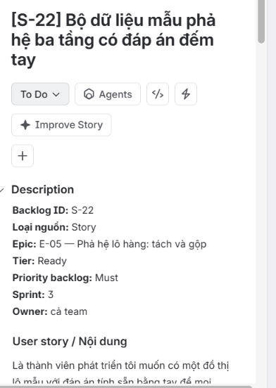
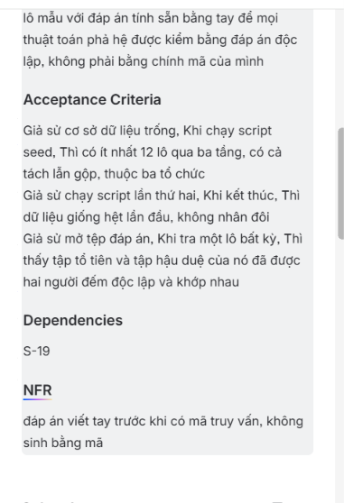

# S-22 — Bộ dữ liệu mẫu pha hệ ba tầng có đáp án đếm tay

## 1. Thông tin Story

| Thuộc tính | Nội dung |
|---|---|
| Backlog ID | **S-22** |
| Loại nguồn | Story |
| Epic | **E-05 – Pha hệ lô hàng: tách và gộp** |
| Tier | Ready |
| Priority backlog | Must |
| Sprint | **3** |
| Owner | Cả team |
| Dependency | **S-19** |
| NFR | Đáp án viết tay trước khi có mã truy vấn, không sinh bằng mã |

## 2. User Story

Là thành viên phát triển, tôi muốn có một bộ dữ liệu mẫu với đáp án tính sẵn bằng tay để mọi thuật toán pha hệ được kiểm bằng đáp án độc lập, không phải bằng chính mã của mình.

Mục đích là tạo một bộ dữ liệu chuẩn để kiểm thử thuật toán tách/gộp lô hàng theo cách có thể đối chiếu độc lập với kết quả chương trình.

## 3. Acceptance Criteria

### AC1 – Seed dữ liệu tối thiểu
Giả sử cơ sở dữ liệu đang trống. Khi chạy script seed, phải có **ít nhất 12 lô qua ba tầng**, có cả thao tác **tách và gộp**, thuộc **ba tổ chức**.

### AC2 – Seed có tính lặp lại
Giả sử chạy script lần thứ hai. Khi kết thúc, dữ liệu phải **giống hệt lần đầu**, không được nhân đôi bản ghi.

### AC3 – Đáp án đếm tay
Giả sử mở tệp đáp án. Khi tra một lô bất kỳ, phải thấy tập tổ tiên và tập hậu duệ của lô đó đã được tính/ghi trước bằng tay và có thể đối chiếu độc lập.

## 4. Yêu cầu dữ liệu

Bộ seed cần thể hiện đủ:
- Ba tầng trong chuỗi lô hàng.
- Ít nhất 12 lô.
- Ba tổ chức tham gia.
- Có quan hệ tách lô.
- Có quan hệ gộp lô.
- Có dữ liệu để kiểm tra cả chiều **tổ tiên** và **hậu duệ**.
- Có dữ liệu lặp lại được khi chạy seed.

## 5. Nguyên tắc đáp án

Đáp án phải được tính và ghi trước khi triển khai truy vấn/thuật toán. Không dùng chính chương trình cần kiểm thử để sinh đáp án vàng.

Có thể lưu đáp án theo dạng:

| Lot | Tổ tiên (ancestors) | Hậu duệ (descendants) |
|---|---|---|
| LOT-01 | ghi tay | ghi tay |
| LOT-02 | ghi tay | ghi tay |
| LOT-03 | ghi tay | ghi tay |

> Khi nhóm đã có mã định danh lô cụ thể trong repository, thay các mã mẫu bằng ID thực tế của bộ seed.

## 6. Kiểm tra tính idempotent

Luồng kiểm thử:

```text
Database trống
      |
      v
Chạy seed lần 1
      |
      v
Kiểm tra số lượng + quan hệ
      |
      v
Lưu kết quả chuẩn
      |
      v
Chạy seed lần 2
      |
      v
So sánh với lần 1
      |
      +---- giống nhau ----> PASS
      |
      +---- khác nhau -----> FAIL
```

## 7. Test Case

| ID | Kịch bản | Kết quả mong đợi |
|---|---|---|
| TC22-01 | Seed trên DB trống | Tạo ít nhất 12 lô, 3 tầng, 3 tổ chức |
| TC22-02 | Kiểm tra quan hệ tách | Có dữ liệu tách và quan hệ cha-con đúng |
| TC22-03 | Kiểm tra quan hệ gộp | Có dữ liệu gộp và quan hệ nhiều nguồn đúng |
| TC22-04 | Chạy seed lần 2 | Không nhân đôi dữ liệu |
| TC22-05 | Đối chiếu một lô bất kỳ | Ancestors/descendants khớp đáp án viết tay |
| TC22-06 | Đối chiếu các lô biên | Lô đầu/cuối chuỗi vẫn cho kết quả đúng |
| TC22-07 | Kiểm tra 3 tổ chức | Dữ liệu chứa đủ 3 tổ chức theo thiết kế |
| TC22-08 | Kiểm tra đáp án độc lập | Đáp án không được sinh từ truy vấn/thuật toán đang kiểm thử |

## 8. Dependency

S-22 phụ thuộc **S-19**. Cần bảo đảm mô hình/dữ liệu nền từ S-19 đã sẵn sàng trước khi chạy bộ seed.

## 9. NFR

**Đáp án viết tay trước khi có mã truy vấn, không sinh bằng mã.**

Điều này bảo đảm bộ đáp án vàng là nguồn kiểm chứng độc lập, tránh trường hợp cùng một lỗi xuất hiện trong cả code và đáp án.

## 10. Minh chứng

### Story S-22


### Acceptance Criteria S-22


## 11. Kết luận

S-22 cung cấp bộ dữ liệu vàng phục vụ kiểm thử các thuật toán pha hệ lô hàng. Bộ dữ liệu phải có ít nhất 12 lô, trải qua 3 tầng, thuộc 3 tổ chức, có cả tách và gộp; seed phải idempotent và đáp án ancestors/descendants phải được tính độc lập bằng tay.

**Vị trí đề xuất khi gộp vào branch `feature/s2-backend`:**

```text
S22/
├── README.md
└── images/
    ├── 01-story-S22.png
    └── 02-acceptance-criteria-S22.png
```
