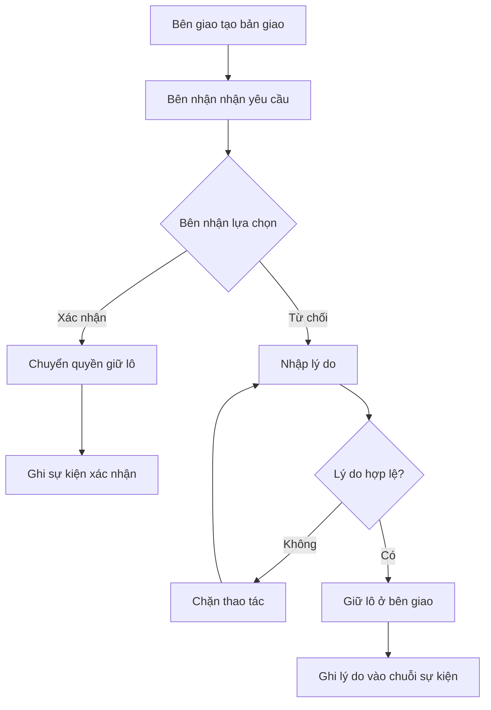
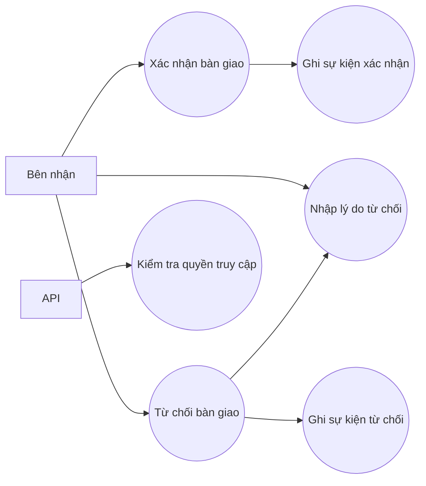

# S-16 — Bên nhận xác nhận hoặc từ chối bàn giao kèm lý do

## 1. Thông tin Story

| Thuộc tính | Nội dung |
|---|---|
| Backlog ID | S-16 |
| Loại nguồn | Story |
| Epic | E-04 — Sự kiện chuỗi cung ứng và chuỗi bàn ghi hậu sở hữu |
| Tier | Ready |
| Priority backlog | Must |
| Sprint | 2 |
| Owner | Cả team |
| Dependency | S-15 |

## 2. User Story

> **Là hợp tác xã sở chế**, tôi muốn việc nhận lô phải có xác nhận của tôi để không ai đẩy trách nhiệm một lô hàng sang tôi mà tôi chưa thực sự nhận.

## 3. Mục tiêu

Chức năng cho phép bên nhận:
- Xác nhận đã nhận bàn giao.
- Từ chối bàn giao và bắt buộc nhập lý do.
- Khi xác nhận, quyền/chuỗi sự kiện được chuyển sang bên nhận.
- Khi từ chối, lý do được ghi vào chuỗi sự kiện.
- Chặn trường hợp từ chối nhưng để trống lý do.
- Từ chối API xác nhận nếu người gọi không thuộc tổ chức nhận.

## 4. Acceptance Criteria

### AC-01 — Xác nhận bàn giao
**Given:** Có bản giao cho tôi.  
**When:** Tôi xác nhận.  
**Then:** Quyền giữ lô chuyển sang tôi và một sự kiện xác nhận được ghi tiếp vào chuỗi.

### AC-02 — Từ chối có lý do
**Given:** Có bản giao cho tôi.  
**When:** Tôi từ chối kèm lý do.  
**Then:** Lô vẫn ở chỗ bên giao và lý do được ghi vào chuỗi sự kiện.

### AC-03 — Từ chối không có lý do
**Given:** Tôi từ chối mà để trống lý do.  
**When:** Tôi bấm từ chối.  
**Then:** Hệ thống chặn thao tác và yêu cầu nhập lý do.

### AC-04 — Kiểm tra quyền API
**Given:** Một người khác của tổ chức khác gọi API xác nhận bàn giao không dành cho họ.  
**When:** Họ gửi yêu cầu xác nhận.  
**Then:** API trả về **403 Forbidden**.

## 5. Luồng nghiệp vụ



## 6. Use Case



## 7. Tiêu chí hoàn thành

- [ ] Có màn hình/nút **Xác nhận** và **Từ chối**.
- [ ] Xác nhận chuyển quyền giữ lô đúng bên nhận.
- [ ] Từ chối bắt buộc có lý do.
- [ ] Lý do từ chối được lưu vào chuỗi sự kiện.
- [ ] API kiểm tra đúng tổ chức/người nhận.
- [ ] Người không có quyền nhận bị trả về HTTP 403.
- [ ] Các test case trong `test-cases.md` đạt kết quả Pass.
- [ ] Code được commit và push lên Git.

## 8. Cấu trúc repository

```text
S16-ban-giao-xac-nhan-tu-choi/
├── README.md
├── report.md
├── test-cases.md
└── diagrams.md
```

## 9. Git commands

```bash
git init
git add .
git commit -m "feat: implement S-16 handover confirmation and rejection"
git branch -M main
git remote add origin <LINK_REPOSITORY>
git push -u origin main
```
