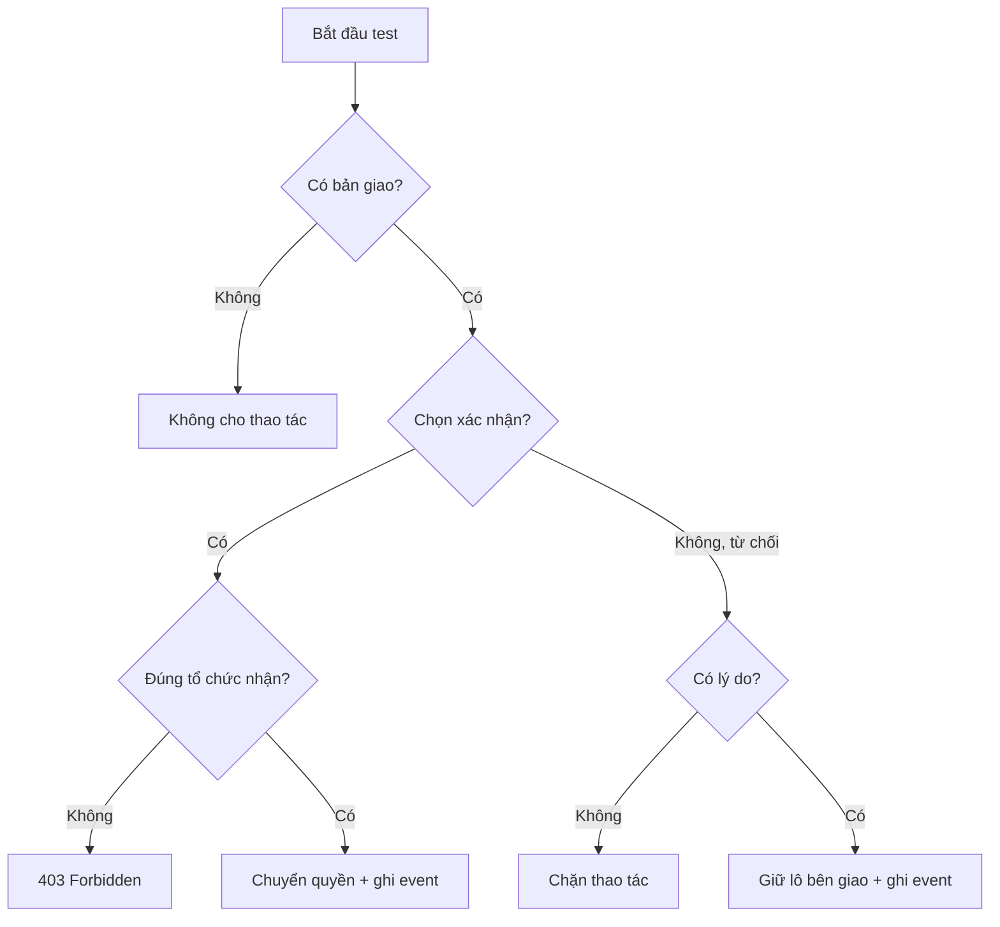

# TEST CASE — S-16

| ID | Test case | Điều kiện | Thao tác | Kết quả mong đợi |
|---|---|---|---|---|
| TC-01 | Xác nhận bàn giao | Có bản giao hợp lệ | Bấm Xác nhận | Quyền giữ lô chuyển sang bên nhận và ghi event xác nhận |
| TC-02 | Từ chối có lý do | Có bản giao hợp lệ | Bấm Từ chối, nhập lý do, gửi | Lô vẫn ở bên giao; lý do được ghi vào chuỗi sự kiện |
| TC-03 | Từ chối không lý do | Có bản giao hợp lệ | Bấm Từ chối nhưng để trống lý do | Hệ thống chặn và yêu cầu nhập lý do |
| TC-04 | Người khác tổ chức gọi API | Người gọi không thuộc tổ chức nhận | Gọi API xác nhận | API trả HTTP 403 Forbidden |
| TC-05 | Lý do chỉ có khoảng trắng | Có bản giao | Nhập `"   "` rồi từ chối | Hệ thống không chấp nhận, yêu cầu lý do hợp lệ |
| TC-06 | Kiểm tra event sau xác nhận | Xác nhận thành công | Xem lịch sử sự kiện | Có event xác nhận tương ứng |
| TC-07 | Kiểm tra event sau từ chối | Từ chối thành công | Xem lịch sử sự kiện | Có event từ chối và nội dung lý do |
| TC-08 | Kiểm tra trạng thái sau từ chối | Từ chối thành công | Xem thông tin lô | Lô vẫn thuộc bên giao |

## Sơ đồ kiểm thử

## Definition of Done

- [ ] TC-01 Pass
- [ ] TC-02 Pass
- [ ] TC-03 Pass
- [ ] TC-04 Pass
- [ ] TC-05 Pass
- [ ] TC-06 Pass
- [ ] TC-07 Pass
- [ ] TC-08 Pass
- [ ] Code review hoàn tất
- [ ] Push lên repository Git
